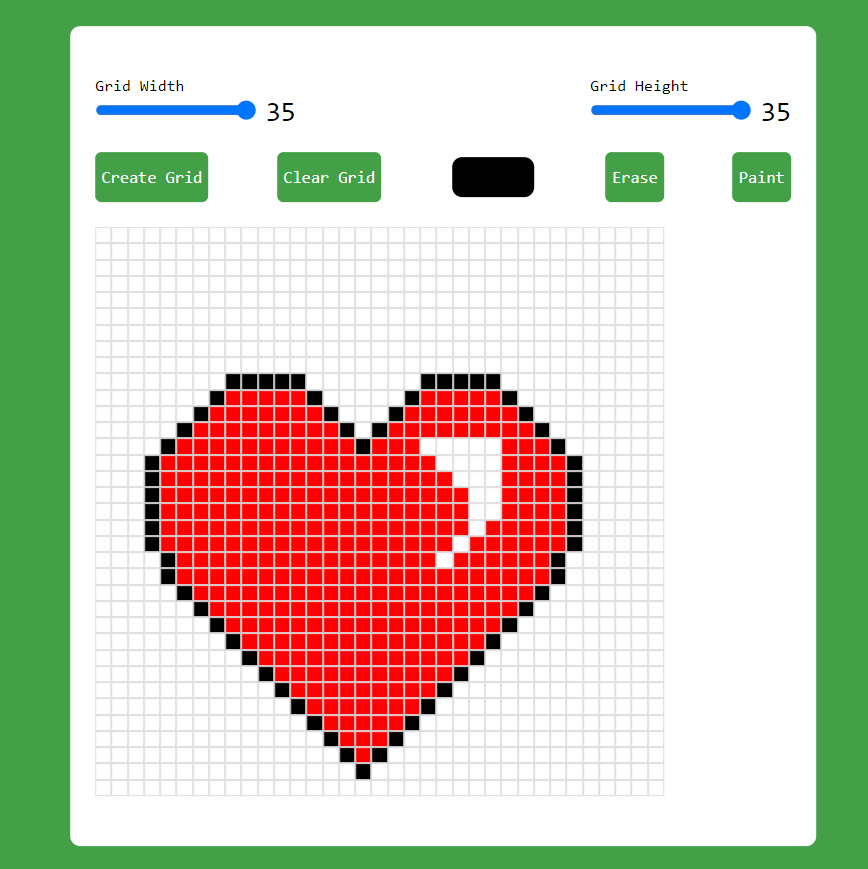

# Pixel Art Generator




## Overview

The Pixel Art Generator is a simple tool that allows users to create pixel art images effortlessly. Whether you're a seasoned pixel artist or just getting started, this generator provides a user-friendly interface for crafting pixelated masterpieces.

## Demo

Check out the [Pixel Art Generator Demo](https://gibrail404.github.io/Pixel-Art-Generator/) to see the tool in action.

## Features

- **Intuitive Interface:** Easily create pixel art with a user-friendly design.
- **Customizable Grid:** Adjust the grid size to fit your artistic vision.
- **Color Palette:** Choose from a variety of colors to bring your art to life.
- **Export Options:** Save your pixel art as PNG or GIF files.

## Getting Started

1. Clone the repository:

   ```bash
   git clone https://github.com/Gibrail404/Pixel-Art-Generator.git
Open index.html in your preferred web browser.

Start creating pixel art!

## Usage

Choose a color from the palette.
Click on a pixel to fill it with the selected color.
Use the grid to guide your pixel placement.
Export your pixel art when finished.

## Contact

For any issues, feedback, or general inquiries, please contact us at gibrailzaidi@gmail.com.

## License

This project is licensed under the MIT License. Feel free to use, modify, and distribute the code for your own purposes. Refer to the LICENSE file for more details.
